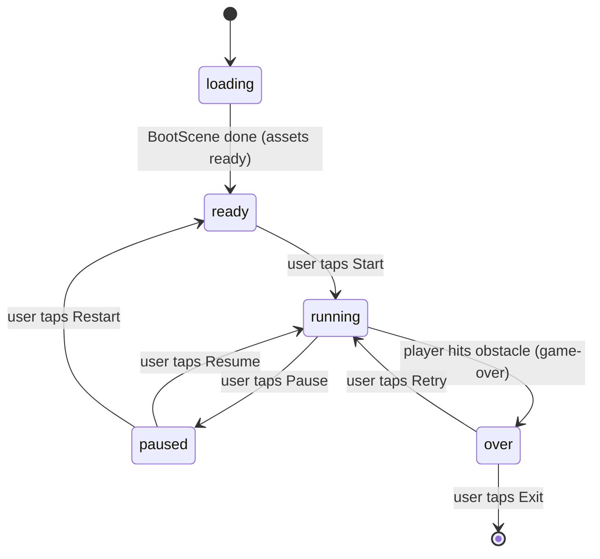

# Udaipur Temple Run — Game Flow & Build Spec (v1)

**Reference document for Claude Code.**
Build a 2.5D lane-runner web game using **Phaser 3** mounted inside **one React component**, in an existing **React + Vite + JSX + TailwindCSS** project. This spec defines v1: a single playable level to prove the approach works, using placeholder graphics so it runs with no asset downloads.

---

## 1. Goal & scope

**Goal of v1:** a playable, smooth lane runner that proves the React + Phaser approach. One developer, fast to ship.

**In scope (build this):**
- One reusable `RunScene` (the runner gameplay).
- 3-lane dodging via lane-switching.
- Coins to collect (score) and obstacles to avoid (game over on hit).
- A React app shell: start screen → game → game-over screen, with a Tailwind HUD overlay.
- React ↔ Phaser communication via a shared EventBus.
- Placeholder graphics generated at runtime (no asset files needed).
- Mobile (touch) + desktop (keyboard) controls.

**Out of scope for v1 (do NOT build yet, leave clean extension points):**
- Jump / slide mechanics (lane-switch only for now).
- Multiple levels / the 6-level structure.
- Quiz pop-ups, hidden-object stages, scroll-fragment assembly.
- Real Udaipur art, audio, particle polish.
- Team scoring, leaderboard, backend submission (stub the final-score callback).

---

## 2. Tech stack & dependencies

- Existing: React + Vite + JSX + TailwindCSS (+ Framer Motion available).
- Add one dependency:

```bash
npm install phaser
```

- Phaser version: 3.x (latest stable).
- No other runtime dependencies for v1.

---

## 3. Project structure

Create the game under `src/games/templeRun/`:

```
src/
  games/
    templeRun/
      TempleRun.jsx            # React component; mounts Phaser, renders HUD + overlays
      hud/
        Hud.jsx                # score/coins overlay (Tailwind)
        StartScreen.jsx        # intro + Start button
        GameOverScreen.jsx     # final score + Retry / Exit
      game/
        config.js              # Phaser.Game config + GAME constants
        EventBus.js            # shared event emitter (React <-> Phaser bridge)
        scenes/
          BootScene.js         # generate placeholder textures, then start RunScene
          RunScene.js          # the lane-runner gameplay loop
        objects/
          Player.js            # player sprite + lane-switch logic
          Lane.js              # lane geometry helpers (x positions, scaling)
        data/
          levelConfig.js       # tunable level settings (so levels are data-driven later)
```

Mount the game on a route or screen, code-split so Phaser only loads here:

```jsx
import { lazy, Suspense } from 'react';
const TempleRun = lazy(() => import('@/games/templeRun/TempleRun'));

<Suspense fallback={<div className="grid h-full place-items-center">Loading…</div>}>
  <TempleRun onComplete={(score) => console.log('final score', score)} />
</Suspense>
```

---

## 4. Game flow (state machine)

The React component (`TempleRun.jsx`) holds a `phase` state and renders the matching screen. Phaser drives transitions via EventBus events.



**Phases and what's shown:**

| Phase | React renders | Phaser state |
|---|---|---|
| `loading` | Loading spinner | BootScene preloading/generating textures |
| `ready` | `StartScreen` (title + Start button) | RunScene created but paused/idle |
| `running` | `Hud` overlay (score, coins, pause) | RunScene active |
| `paused` | Pause overlay (Resume/Restart) | RunScene paused |
| `over` | `GameOverScreen` (final score, Retry/Exit) | RunScene stopped |

---

## 5. Gameplay spec — 2.5D lane runner

**Orientation:** portrait, mobile-first. Camera looks down the road toward a vanishing point at the top.

**Lanes:** 3 lanes (left / center / right). The player auto-runs "forward"; the world scrolls toward the player. Obstacles and coins spawn at the far end (top of screen) and move toward the player (downward), **scaling up** from far to near to fake depth.

**Player:**
- Fixed near the bottom of the screen (`PLAYER_Y`), always at full scale.
- Starts in the center lane.
- Switches lanes by tweening its x to the target lane over `LANE_SWITCH_MS`.
- Cannot move past the outer lanes.

**Controls:**

| Action | Desktop | Mobile |
|---|---|---|
| Move left | Arrow Left / `A` | Swipe left |
| Move right | Arrow Right / `D` | Swipe right |
| Pause | `Esc` / `P` | Pause button (HUD) |

(Jump/slide intentionally omitted in v1.)

**Obstacles:** spawn in a random lane at the far end, move toward the player, scale up. Colliding with the player → `game-over`.

**Coins:** spawn in a random lane, move toward the player, scale up. Overlapping the player → collected, `+COIN_POINTS`, removed (recycled).

**Fairness rule (important):** never spawn obstacles in all three lanes at the same depth — at least one lane must always be passable. Spawn one item per "row," or guarantee a gap.

**Difficulty:** scroll speed starts at `START_SPEED` and ramps slowly toward `MAX_SPEED` as distance increases.

---

## 6. RunScene loop behavior

`RunScene` is the single reusable gameplay scene (later parameterized per level via `levelConfig`).

- **create():**
  - Read level config (speed, spawn rate, theme color).
  - Set up a scrolling road background using a `tileSprite` (placeholder: solid color + lane lines), plus 1–2 parallax layers for depth feel.
  - Create the player in the center lane at `PLAYER_Y`.
  - Create **pooled groups** for obstacles and coins (`maxSize` set; reuse, never destroy mid-run).
  - Register input: keyboard (arrows/AD) + pointer/swipe detection.
  - Set up overlap checks: player×obstacles → `hitObstacle`; player×coins → `collectCoin`.
  - Start a spawn timer (`SPAWN_INTERVAL`).
  - Start a throttled score timer (every 100ms): increment distance score, `EventBus.emit('score-update', score)`.
  - `EventBus.emit('ready')`.

- **update(time, delta):**
  - Scroll the road/parallax by `speed * (delta / 1000)` (delta-time so it's device-independent).
  - Move active obstacles/coins toward the player and update their scale based on their y-progress (far→near).
  - Recycle any item past the bottom back into its pool.
  - Gradually ramp `speed` toward `MAX_SPEED`.

- **spawn():** pick a random lane (respecting the fairness rule), pull an obstacle or coin from the pool, position it at the far point, activate it.

- **hitObstacle():** `EventBus.emit('game-over', finalScore)`, stop spawning, pause the scene.

- **collectCoin(coin):** recycle the coin, add `COIN_POINTS`, `EventBus.emit('coins-update', coins)`.

- **React → scene commands** (subscribe in `create`, unsubscribe on `shutdown`): `pause`, `resume`, `restart`.

**Lane scaling helper (`Lane.js`):** given a normalized depth `t` (0 = far, 1 = near), return the on-screen x for a lane and the scale (`SCALE_FAR`→`SCALE_NEAR`). Lane x values should converge slightly toward center at the far end to sell the perspective.

---

## 7. React ↔ Phaser bridge (EventBus contract)

`EventBus.js` exports a single shared emitter:

```js
import Phaser from 'phaser';
export const EventBus = new Phaser.Events.EventEmitter();
```

**Phaser → React (game emits, React listens):**

| Event | Payload | Meaning |
|---|---|---|
| `ready` | — | RunScene created; safe to show Start |
| `score-update` | `number` | Distance score changed (throttled, ~10/sec) |
| `coins-update` | `number` | Coin count changed |
| `game-over` | `number` (final score) | Player hit an obstacle |

**React → Phaser (React emits, scene listens):**

| Event | Payload | Meaning |
|---|---|---|
| `pause` | — | Pause the run |
| `resume` | — | Resume the run |
| `restart` | — | Reset and restart the run |

**Rules for Claude Code:**
- Always remove listeners on React unmount and on Phaser scene `shutdown` to avoid leaks/double-binding.
- Destroy the Phaser game instance (`game.destroy(true)`) when `TempleRun` unmounts.
- Never update React state every frame — only via the throttled events above.

---

## 8. Component contracts

**`TempleRun.jsx`**
- Props: `onComplete?: (finalScore: number) => void`.
- Owns: a container `div` (Phaser parent), the `phase` state machine, and the EventBus subscriptions.
- Renders the canvas container plus the phase-appropriate React screen/overlay on top (absolute positioned, Tailwind).
- On `game-over`, set phase to `over` and call `onComplete(finalScore)`.

**`StartScreen.jsx`** — title + "Start" button; on click → set phase `running` and `EventBus.emit('resume')` (or start the scene).

**`Hud.jsx`** — top bar with score + coin count + pause button. `pointer-events-none` except the pause button. Reads score/coins via props from `TempleRun`.

**`GameOverScreen.jsx`** — final score, "Retry" (→ `EventBus.emit('restart')`, phase `running`) and "Exit" buttons.

Use Tailwind for all React UI. Keep the HUD legible over the canvas (text shadow / semi-opaque pill backgrounds).

---

## 9. Assets (v1 = no downloads)

For v1, **generate placeholder textures at runtime** in `BootScene` using Phaser Graphics → `generateTexture`, so the game runs with zero asset files:

- `player` — rounded rectangle (distinct color, e.g. amber).
- `obstacle` — block/rounded rect (e.g. red).
- `coin` — small circle (e.g. yellow/gold).
- `road` — solid color tile with two lane-divider lines.
- background parallax — simple flat color bands.

**Swap-in points (future, free assets):** mark each `generateTexture` call with a `// TODO: replace with atlas frame` comment. Later, load a free CC0 sprite atlas (e.g. from kenney.nl) in `BootScene.preload` and reference frames instead. No gameplay code should need to change — only the texture source.

---

## 10. Scoring (v1)

- Distance score: `+1` per throttled tick while running.
- Coin: `+COIN_POINTS` (10) each.
- Final score (shown on Game Over) = distance score + coin total.

The brief's full scoring model (level completion, quiz points, time bonus, max 500, team bonuses) is **future** — v1 just needs a working score + game-over.

---

## 11. Tunable constants (`game/config.js`)

Expose these as named constants so they're easy to tune. Suggested starting values:

```js
export const GAME = {
  BASE_WIDTH: 450,
  BASE_HEIGHT: 800,
  LANES_X: [0.25, 0.5, 0.75],   // fraction of width (near edge)
  PLAYER_Y: 0.80,                // fraction of height
  SPAWN_Y: 0.10,                 // far point (fraction of height)
  SCALE_FAR: 0.5,
  SCALE_NEAR: 1.0,
  START_SPEED: 320,              // px/sec at start
  MAX_SPEED: 620,
  SPEED_RAMP: 6,                 // px/sec added per second of play
  SPAWN_INTERVAL: 950,           // ms between spawns
  LANE_SWITCH_MS: 150,
  COIN_POINTS: 10,
  POOL_OBSTACLES: 12,
  POOL_COINS: 16,
};
```

Phaser config: `type: Phaser.AUTO` (WebGL with Canvas fallback), `Phaser.Scale.RESIZE` + `CENTER_BOTH`, arcade physics, `powerPreference: 'high-performance'`.

---

## 12. Performance requirements (bake these in from the start)

- **Object pooling** for obstacles and coins — reuse, never create/destroy mid-run.
- **Texture atlas-ready** structure (single sprites for v1; easy atlas swap later).
- **Delta-time** for all movement and scrolling.
- **Throttle** React updates to the EventBus events only (no per-frame `setState`).
- **Cap device pixel ratio** to ~2 on the canvas to avoid over-rendering on high-DPR phones.
- **Code-split** the game (lazy import) so Phaser loads only on this screen.
- **Arcade physics only** — no Matter.js.
- Clean teardown on unmount (destroy game, remove listeners).

Target: steady frame rate on a mid-range phone; playable on desktop with keyboard.

---

## 13. Acceptance criteria (definition of done for v1)

1. `npm run dev` → the game loads on its route/screen.
2. Start screen appears; tapping **Start** begins the run.
3. The road/parallax scrolls, giving a clear sense of forward motion.
4. Three lanes; **Arrow keys / A,D** and **swipe left/right** smoothly switch the player's lane.
5. Obstacles and coins spawn at the far end, move toward the player, and **scale up** (2.5D depth).
6. Collecting a coin raises the score; the HUD updates.
7. Hitting an obstacle ends the run; the **Game Over** screen shows the final score.
8. **Retry** restarts cleanly with no leftover state or memory leak; **Exit** unmounts cleanly.
9. At least one lane is always passable (no unavoidable obstacle rows).
10. Works on both touch (mobile) and keyboard (desktop).

---

## 14. Suggested build order for Claude Code

1. **Scaffold:** install Phaser; create the folder structure; add the lazy-loaded route and an empty `TempleRun.jsx` that mounts a blank Phaser game in a `useEffect` with clean teardown.
2. **EventBus + config:** add `EventBus.js`, `config.js` with the `GAME` constants and Phaser config.
3. **BootScene:** generate placeholder textures, then start `RunScene`; emit `ready`.
4. **RunScene — motion:** scrolling road + parallax with delta-time; player in center lane.
5. **Controls:** keyboard + swipe lane-switching with a smooth tween.
6. **Spawning + pooling:** obstacles and coins from pools, far→near movement with scaling, recycling, fairness rule.
7. **Collisions + scoring:** coin collect (+points), obstacle hit (game-over); throttled `score-update`.
8. **React shell:** StartScreen, Hud, GameOverScreen wired to the `phase` state and EventBus.
9. **Polish pass:** speed ramp, DPR cap, verify teardown/restart, check acceptance criteria.

---

*End of spec — v1.*
